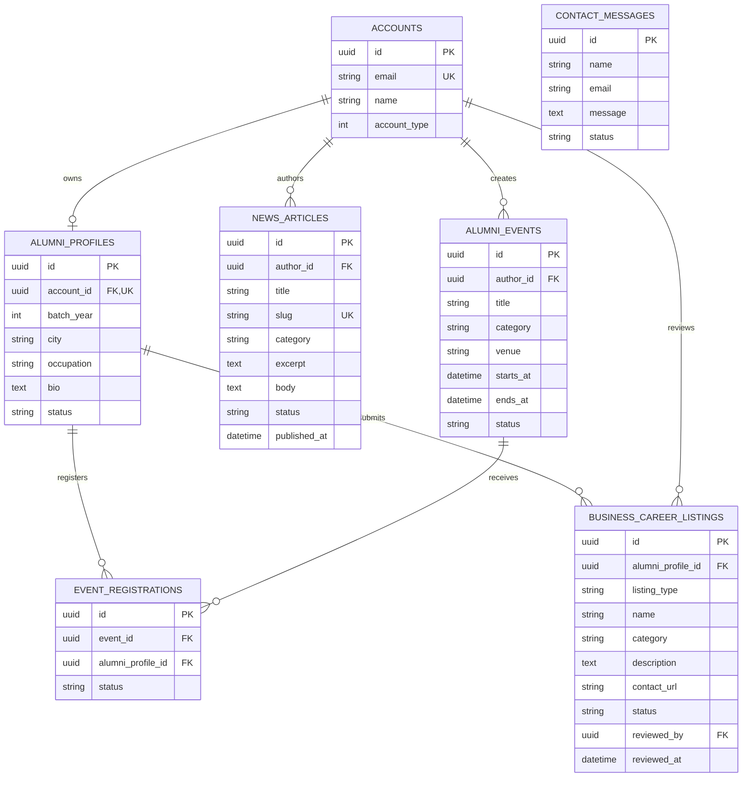

# AlumniHub ERD

The alumni domain is additive to the existing LMS schema. Existing `accounts` remain the authentication identity; `alumni_profiles.account_id` is a one-to-one foreign key to `accounts.id`.

`status` values: profiles `pending|approved|rejected`; news and events `draft|published|archived`; listings `pending|approved|rejected`; registrations `registered|cancelled|attended`; contact messages `new|read|closed`.